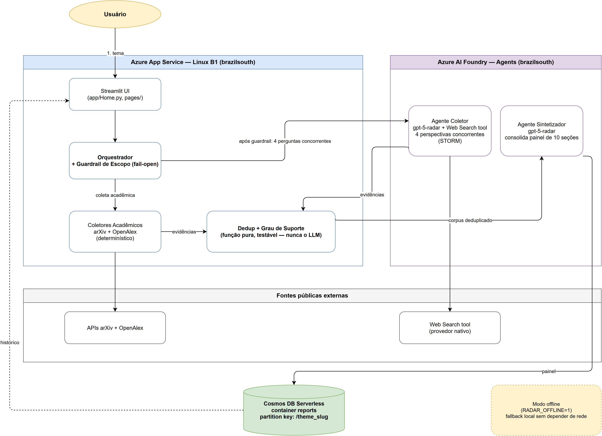
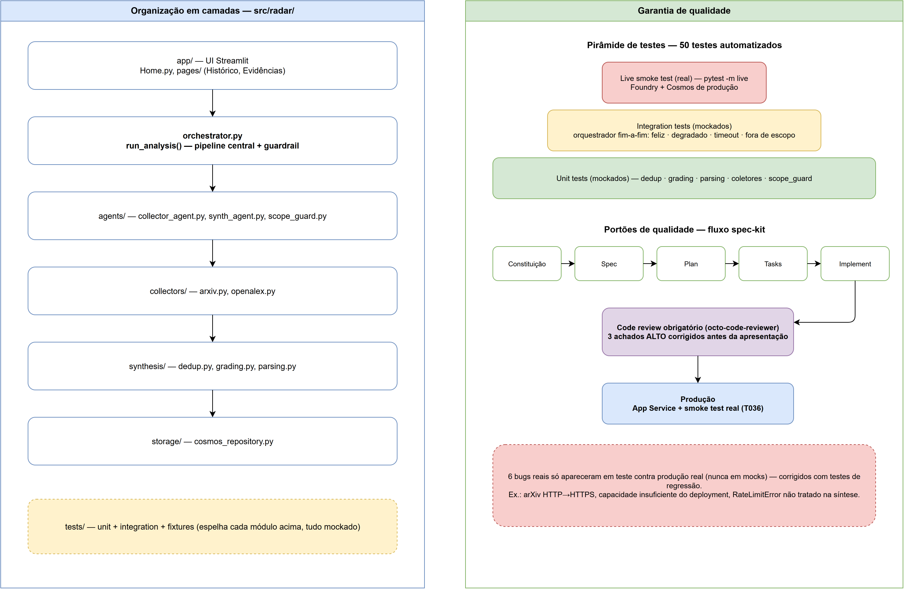
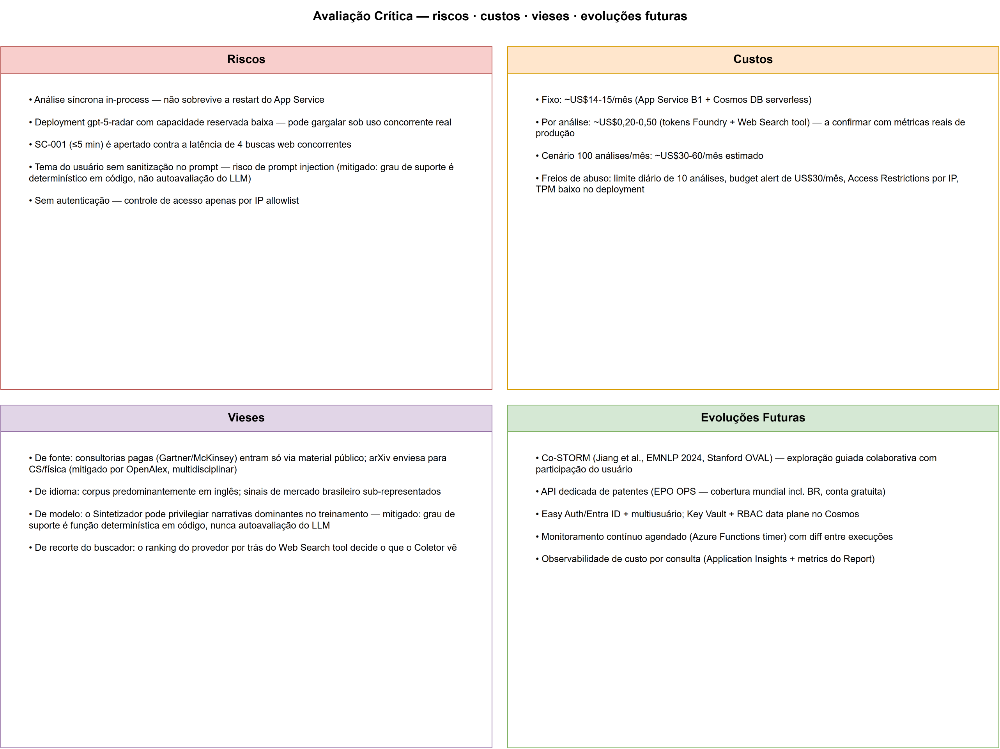

# Material de Apoio — Critérios de Avaliação da Banca

Este documento endereça diretamente três dos critérios de avaliação do desafio
**SENAI Futuro — IA**: *Arquitetura da solução*, *Qualidade de implementação* e
*Avaliação crítica*. Cada seção traz um diagrama e o texto que o explica. O conteúdo é
uma síntese visual do que já está registrado em detalhe em
[`docs/architecture.md`](../architecture.md) e [`docs/critical-review.md`](../critical-review.md)
— este documento não substitui aqueles, apenas os torna apresentáveis em uma imagem.

---

## 1. Arquitetura da solução

**Qualidade das decisões técnicas.** O sistema é dividido em quatro camadas com
responsabilidades bem separadas: (1) **UI Streamlit** no App Service, que só coleta o
tema e renderiza o painel; (2) o **Orquestrador**, único ponto que decide o fluxo de uma
análise e onde vive o guardrail de escopo (rejeita temas fora do domínio industrial/tecnológico
antes de gastar chamadas caras); (3) a **camada de coleta**, dividida em coleta
acadêmica determinística (arXiv + OpenAlex, sem LLM) e um Agente Coletor no Azure AI
Foundry que faz 4 perguntas concorrentes de mercado (perspectivas técnica, econômica,
industrial e regulatória — técnica adaptada de STORM, Shao et al., NAACL 2024, Stanford
OVAL); e (4) a **camada de síntese e persistência**, onde a deduplicação e o grau de
suporte de cada afirmação são calculados em **código determinístico, nunca pelo LLM** —
o Agente Sintetizador só consolida e cita, o veredito de confiabilidade é auditável e
testável isoladamente.

**Justificativa das tecnologias.** Streamlit + App Service foi escolhido pelo prazo de
uma semana e por não haver necessidade de uma API HTTP separada (usuário único, sem
multi-tenant nesta fase). O uso do **Web Search tool** nativo da nova Agents API — em vez
do Bing Grounding "classic" originalmente planejado — não foi uma escolha de design, e
sim resposta a dois bloqueios reais de provisionamento descobertos durante o
desenvolvimento: GPT-4.1/4o estavam em depreciação para novo deployment nesta conta, e o
recurso Bing Grounding (SKU G1) não é elegível na assinatura PAYG usada. Cosmos DB
serverless com um documento agregado por relatório (partition key `/theme_slug`) elimina
joins e mantém o histórico consultável em menos de 5 segundos. App Service e Cosmos DB
foram provisionados em `brazilsouth` — não na região originalmente cogitada — porque
`eastus` estava genuinamente sem capacidade para novas contas Cosmos DB no momento do
deploy; colocalizar com o Foundry na mesma região teve o benefício adicional de eliminar
latência cross-region.

**Capacidade de projetar para produção.** A arquitetura já reflete decisões de
produção, não apenas de protótipo: Managed Identity + RBAC (sem chaves de API no
Foundry), Access Restrictions por IP e limite diário de análises como freio de custo em
uma aplicação pública sem autenticação, modo offline (`RADAR_OFFLINE=1`) para
resiliência de demonstração, e um documento `Report(status=running)` persistido
imediatamente no início do pipeline para sobreviver a quedas de conexão. O caminho de
evolução para escala real (multiusuário, fila assíncrona em vez de execução síncrona
in-process, observabilidade de custo por consulta) está mapeado explicitamente na seção
de avaliação crítica abaixo — não é ignorado, é uma escolha consciente de escopo para o
prazo de uma semana.

---

## 2. Qualidade de implementação

**Organização do código.** O pacote `src/radar/` segue a mesma separação em camadas do
diagrama de arquitetura: `orchestrator.py` é o único ponto de coordenação; `agents/`
contém os três agentes (coletor, sintetizador, guardrail de escopo); `collectors/` isola
as integrações determinísticas (arXiv, OpenAlex); `synthesis/` contém as funções puras de
deduplicação, graduação de suporte e parsing/validação da saída do LLM; `storage/`
encapsula o Cosmos DB. `app/` (Streamlit) não contém lógica de negócio — apenas chama o
Orquestrador e renderiza. Essa separação existe precisamente para que a camada mais
crítica do sistema (o cálculo de grau de suporte) seja testável isoladamente, sem mockar
um agente inteiro.

**Testes e robustez.** 50 testes automatizados cobrem os módulos críticos: dedup, grau de
suporte, parsing da saída do Sintetizador, coletores acadêmicos, o guardrail de escopo, e
o orquestrador completo — incluindo fluxo feliz, degradação parcial (uma fonte falha, as
demais completam), degradação total, timeout e tema fora de escopo. Esse último nível
(orquestrador fim-a-fim com múltiplos cenários de falha) existe porque o **Princípio IV
da constituição do projeto exige resiliência de demonstração**: nenhuma falha de uma
única fonte pode derrubar a análise inteira. Acima da suíte mockada, `pytest -m live`
roda contra Foundry e Cosmos DB de produção reais — validado nos dois temas de exemplo do
desafio (Edge AI: 123s, 53 evidências, 4 tipos de fonte; Robôs Humanoides: 36,8s, 44
evidências, 3 tipos de fonte — ambos dentro dos critérios de sucesso SC-001 e SC-005).

**Boas práticas e portões de qualidade.** O projeto seguiu o fluxo spec-kit completo
(constituição → especificação → plano → tarefas → implementação), com uma revisão de
código obrigatória (`octo-code-reviewer`) antes da apresentação — que encontrou e corrigiu
3 achados de severidade alta, todos bugs reais de resiliência (um deles quebrava
completamente o Princípio IV: uma exceção não tratada no parsing do OpenAlex derrubava a
análise inteira em vez de degradar). **Um ponto de honestidade deliberado**: 3 dos 6 bugs
reais só apareceram no smoke test contra APIs de produção reais — nunca nos testes
mockados. Isso não é uma falha do processo de testes; é evidência de que testes mockados
sozinhos não bastam para validar integração com serviços externos, e por isso o smoke
test real (`infra/smoke_test.py`) é parte do processo de release, não um extra opcional.

---

## 3. Avaliação crítica

**Riscos.** O maior risco arquitetural conhecido é que a análise roda de forma síncrona
e in-process no Streamlit — um restart do App Service durante uma análise em andamento a
interrompe (mitigado parcialmente por persistir o status `running` imediatamente, mas sem
retomada automática). O deployment `gpt-5-radar` tem capacidade reservada
deliberadamente baixa para isolar custos de outras ferramentas na mesma conta Azure, o
que pode gargalar sob uso concorrente real — já observado durante o smoke test, corrigido
elevando de 10 para 200 unidades. A meta de latência (SC-001, ≤5 minutos) é apertada
contra o custo de 4 buscas web concorrentes por análise. E o tema do usuário entra sem
sanitização no prompt do LLM — um vetor teórico de prompt injection, mitigado
estruturalmente pelo fato de que o grau de suporte de cada afirmação é uma função
determinística sobre citações, não uma autoavaliação do modelo (o LLM não pode inflar sua
própria credibilidade manipulando o prompt).

**Custos.** A infraestrutura fixa gira em torno de US$14-15/mês (App Service B1 Linux +
Cosmos DB serverless neste volume), e o custo variável por análise é estimado entre
US$0,20 e US$0,50 (tokens do Foundry + chamadas ao Web Search tool) — número ainda a
confirmar contra o Azure Cost Management após a fatura processar, não apenas por
estimativa. Como a aplicação é pública e sem autenticação nesta fase, os freios de abuso
(limite diário de 10 análises, budget alert de US$30/mês, Access Restrictions por IP,
capacidade de token baixa no deployment) são parte deliberada do desenho, não um
afterthought.

**Vieses conhecidos.** Seis vieses estruturais foram identificados e documentados: viés
de fonte (o corpus depende do que consultorias como Gartner/McKinsey publicam
gratuitamente; mitigado nas fontes acadêmicas pela cobertura multidisciplinar da OpenAlex
frente ao viés de arXiv para CS/física), viés de idioma (corpus majoritariamente em
inglês), viés de modelo (o Sintetizador pode privilegiar narrativas dominantes em seu
treinamento — mitigação estrutural: o grau de suporte é calculado em código, nunca
autoavaliado pelo LLM), viés de recorte do buscador (o provedor por trás do Web Search
tool decide o que o Coletor enxerga, parcialmente mitigado pelas 4 perspectivas
concorrentes inspiradas em STORM), viés de cobertura de metadado (achado real de
2026-07-07: evidências científicas quase sempre trazem data de publicação estruturada,
enquanto evidências de notícia/mercado coletadas via Web Search raramente trazem uma
data confiável — em temas com forte presença de mercado, só ~24% das evidências têm
data; os gráficos do painel executivo tratam isso de forma honesta, computando
"Publicações por ano" apenas sobre o subconjunto datado e exibindo um aviso em vez do
gráfico quando o dado é insuficiente, em vez de sugerir uma tendência temporal que o
corpus não sustenta) e viés de recorte de aplicação nos coletores acadêmicos (achado
real de 2026-07-07: busca literal por palavra-chave em temas sem qualificação de
domínio — ex.: "IoT" em vez de "IoT industrial" — podia devolver evidência sem
correlação com o ambiente industrial; mitigado com uma heurística determinística,
`src/radar/collectors/industrial_scope.py`, que qualifica a query booleana enviada às
APIs quando o tema não traz recorte industrial explícito, validada contra as APIs
reais).

**Evoluções futuras.** Priorizadas por valor/esforço: (1) adoção da metodologia
**Co-STORM** (Jiang et al., EMNLP 2024, Stanford OVAL) para melhorar coleta e síntese —
hoje o Coletor roda 4 perguntas fixas em paralelo; o Co-STORM propõe um discurso
colaborativo entre agentes com papéis distintos e um mapa mental dinâmico compartilhado,
que refinaria as perguntas de busca a partir do que já foi encontrado (em vez das 4
perspectivas fixas) e entregaria ao Sintetizador um corpus já pré-organizado por tópico
(em vez de uma lista plana de evidências), além de habilitar participação do usuário no
refinamento das perguntas; (2) uma API dedicada de patentes (EPO OPS, cobertura mundial
incluindo Brasil, conta gratuita), já que o MVP cobre patentes apenas por sinais via busca
web; (3) autenticação multiusuário (Easy Auth/Entra ID) e Key Vault + RBAC no plano de
dados do Cosmos; (4) monitoramento contínuo agendado de temas (Azure Functions timer)
com diff entre execuções; (5) observabilidade de custo por consulta via Application
Insights; (6) inferência de ano de publicação pelo Agente Coletor quando a página não
expõe metadata estruturada, para aumentar a cobertura do gráfico "Publicações por ano"
sem comprometer a integridade do dado; (7) agente de IA para refinamento semântico de
query dos coletores acadêmicos, complementando a heurística determinística atual
(`industrial_scope.py`) que hoje mitiga temas sem recorte de aplicação industrial (ex.:
"IoT" sem qualificação). Nenhum desses itens está implementado — estão aqui exatamente
para mostrar que as fronteiras do sistema são conhecidas e conscientes, não descobertas
de surpresa pela banca.
