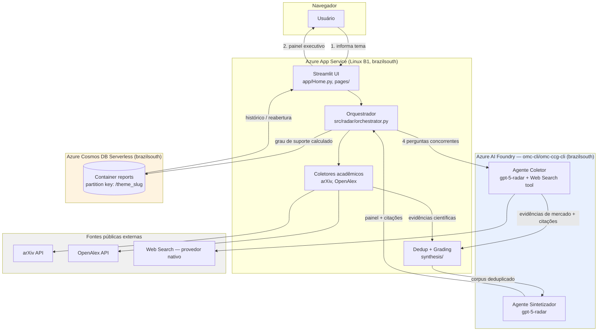

# Arquitetura — Radar de Tendências Tecnológicas

**Última atualização**: 2026-07-04 (fase implement)

## Diagrama de componentes

## Decisões técnicas e justificativas

| Decisão | Justificativa | Referência |
|---|---|---|
| Python + Streamlit, single-project | Prazo de 1 semana, usuário único, sem necessidade de API HTTP separada | Constituição Princípio II, plan.md |
| Coleta acadêmica determinística (arXiv/OpenAlex) via HTTP direto | Metadados estruturados sem chave, cobre "artigos científicos" do desafio | research.md R3 |
| Agente Coletor com **Web Search tool** nativo (não Bing Grounding) | GPT-4.1/4o em deprecating para novo deployment nesta conta; recurso Bing Grounding (SKU G1) inelegível na assinatura (achados reais de provisionamento) | research.md R1 |
| 4 perguntas multi-perspectiva **concorrentes** (asyncio.gather) | Spike T006 mediu 30s/pergunta — sequencial estouraria SC-001 (≤5 min) | research.md R1/R2, spike_result.json |
| Grau de suporte calculado em código, nunca pelo LLM | Auditável e testável; LLM só cita, código gradua (defesa contra alucinação) | research.md R8, contracts §4 |
| Documento agregado único por relatório no Cosmos | Leitura sempre conjunta (painel + evidências); elimina joins, histórico < 5s | research.md R5, data-model.md |
| Modo offline local (`RADAR_OFFLINE=1`) | Resiliência de demo — cache no Cosmos não ajuda se a rede do local cair | research.md R9 |
| Managed Identity + RBAC no Foundry | `DefaultAzureCredential` no App Service só autentica via MI; sem key auth no Foundry | research.md R1, infra/provision.md |
| Cosmos + App Service em brazilsouth (não eastus/eastus2) | eastus estava sem capacidade real para Cosmos DB no momento do deploy (erro `ServiceUnavailable` da Azure); brazilsouth também colocaliza com o Foundry, eliminando latência cross-region | infra/provision.md, docs/critical-review.md |

## Fluxo de dados de uma análise

1. Usuário informa tema → `Orchestrator.run_analysis`.
2. Documento `Report(status=running)` persistido imediatamente (sobrevive a queda de WebSocket).
3. Coleta acadêmica (arXiv + OpenAlex, concorrente) e coleta de mercado (Agente Coletor,
   4 perguntas concorrentes) rodam em paralelo entre si.
4. Evidências combinadas → deduplicadas (URL normalizada + similaridade de título).
5. Corpus deduplicado e numerado (`ev-1`...`ev-N`) → Agente Sintetizador → JSON validado
   contra schema, com retry em caso de falha de parsing.
6. Grau de suporte calculado por seção (função pura, testável) a partir das citações.
7. Documento final `Report(status=completed|partial|failed)` persistido.

## Limitações arquiteturais conhecidas

Ver `docs/critical-review.md` para a lista completa de limitações, vieses e evoluções
futuras (Princípio VI da constituição).
